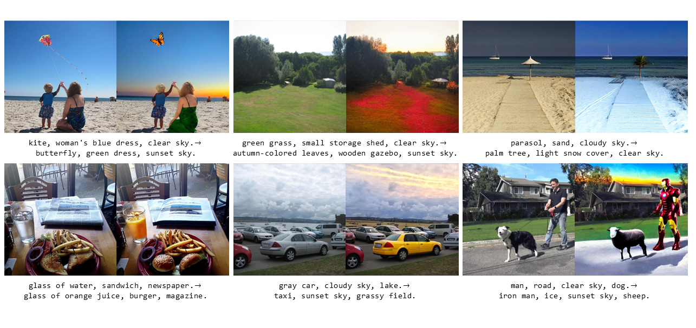
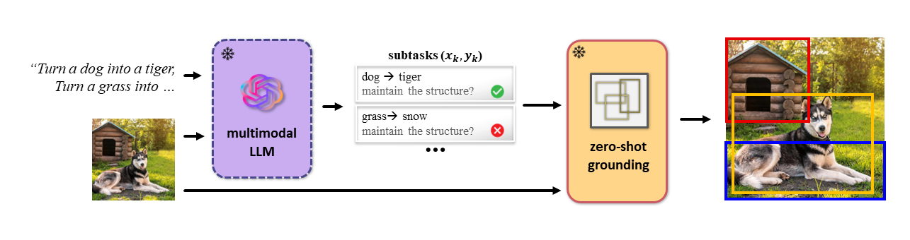
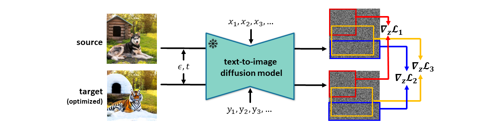

# Ground-A-Score: Scaling Up the Score Distillation for Multi-Attribute Editing
Official pytorch implementation of Ground-A-Score: Scaling Up the Score Distillation for Multi-Attribute Editing

## Abstract
Despite recent advancements in text-to-image diffusion models facilitating various image editing techniques complex text prompts often lead to an oversight of some requests due to a bottleneck in processing text information. To tackle this challenge, we present Ground-A-Score, a simple yet powerful model-agnostic image editing method by incorporating grounding during score distillation. This approach ensures a precise reflection of intricate prompt requirements in the editing outcomes, taking into account the prior knowledge of the object locations within the image. Moreover, the selective application with a new penalty coefficient and contrastive loss helps to precisely target editing areas while preserving the integrity of the objects in the source image. Both qualitative assessments and quantitative analyses confirm that Ground-A-Score successfully adheres to the intricate details of extended and multifaceted prompts, ensuring high-quality outcomes that respect the original image attributes.

<p align="center">
  
</p>

## Overview
<p>
  
<br>
We leverage the prior knowledge from the multimodal LLM and the zero-shot grounding model to break down the user request into multiple image editing subtasks for a single entity.

  
<br>
A pre-trained text-to-image diffusion model is used for each subtask to obtain a corresponding gradient for the source image. These gradients are masked and aggregated to get a total gradient that is efficient and stable.


## setup
### setup conda environment
```
conda env create --file environment.yaml
```
If the installed pytorch version does not match the installed cuda version, reinstall the appropriate pytorch.
### setup grounding dino
Please note official pytorch implementation of grounding dino https://github.com/IDEA-Research/GroundingDINO

Setup as below
```
export CUDA_HOME=/path/to/cuda (ex /usr/local/cuda)
echo 'export CUDA_HOME=/usr/local/cuda' >> ~/.bashrc (/path/to/cuda)
source ~/.bashrc
```

Check with the command below
```
echo $CUDA_HOME
```
And install the grounding dino
```
conda activate groundascore
pip install -e .
```
Downloads weights
```
cd groundingdino
mkdir weights
cd weights
wget -q https://github.com/IDEA-Research/GroundingDINO/releases/download/v0.1.0-alpha/groundingdino_swint_ogc.pth
cd ..
```
### setup LLM model
Put your openai api key at the top of run.py

## Usage
```
python run.py
```


